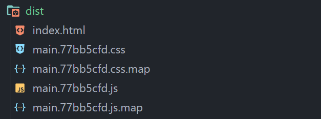

# SASS Tutorial

---

- In this tutorial, we'll discover how to set up Sass from scratch.
- Installing Node on your computer is the first step [node-link](https://nodejs.org/en/download/).
- The following action is creating a folder on your computer. In this instance, I made a folder called "SAAS-DEMO."
- Render to your folder in the terminal, then run `npm init -y` to launch Node.js.
- Run `npm install sass —save-dev` OR `npm install -g sass` after that to add Sass to your folder.
- Make a "`src`" directory, a "`scss`" directory, and a "`main.scss`" file, in that order.
- Write the code below to verify if `Sass` is working (If you know how to write sass code that you are free to write anything).

  ```scss
  $red: red;

  body {
    background: $red;
  }
  ```

- Now write `sass —watch src/scss:dist/css` in the terminal. This will create a directory called `dist`, where `Sass` will compile the `scss` file into the `css` file.
- Install `npm install -g parcel-bundler` from your terminal.
- Because `scss` won't look at `html` files, `scss` won't be randered from `html` files, therefore `parcel` will help to look at `html` files.
- Let's make an `index.html` file and place it in the `\src` directory.
  ```html
  <!DOCTYPE html>
  <html lang="en">
    <head>
      <meta charset="UTF-8" />
      <meta http-equiv="X-UA-Compatible" content="IE=edge" />
      <meta name="viewport" content="width=device-width, initial-scale=1.0" />
      <link rel="stylesheet" href="scss/main.scss" />
      <title>Sass Demo</title>
    </head>
    <body></body>
  </html>
  ```
- We will enter the command to execute `parsel` in the `package.json` file.
- Inside `package.json` there will be a object in that object there will be a `script` inside that write like this,

  ```json
  {
    "script": {
      "dev": "parcel src/index.html",
      "build": "parcel build src/index.html"
    }
  }
  ```

- Go to the Terminal and type `npm run dev`, this will run the `dev` which we wrote as `parcel src/index.html`
- It will looks like this,
  
- `parcel` will create a some file like this,
  
- Now you have successfully created a website using **`Scss`**, Enjoy 😉😉.
